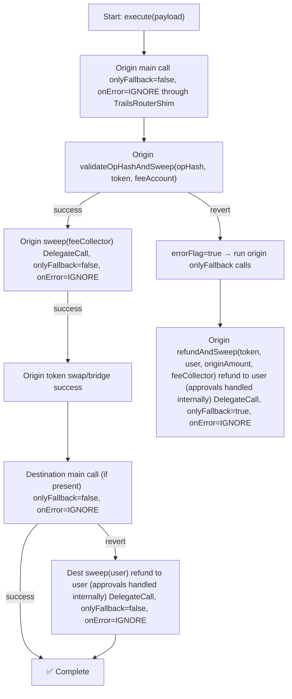

# Trails Contracts

Smart contracts for Sequence Trails - a cross-chain intent execution system that enables seamless token swaps and transfers across different blockchain networks using attestation-based validation.

## Overview

Trails Contracts provides a secure, efficient infrastructure for executing cross-chain intents through Sequence v3 wallets. The system uses off-chain attestations from trusted signers to authorize complex multi-step operations including token swaps, bridges, and conditional execution flows.

## Architecture

### Core Contracts

#### TrailsRouter
**Location:** [`src/TrailsRouter.sol`](src/TrailsRouter.sol)

A consolidated router contract that combines three key functionalities:

1. **Multicall Routing** - Delegates calls to Multicall3 while preserving msg.sender context
   - `execute()` - Execute multiple calls in sequence via delegatecall
   - `pullAndExecute()` - Pull user's full ERC20 balance, then execute multicall
   - `pullAmountAndExecute()` - Pull specific ERC20 amount, then execute multicall

2. **Balance Injection** - Dynamically inject token balances into calldata
   - `injectSweepAndCall()` - Sweep tokens from msg.sender, inject balance into calldata, execute call
   - `injectAndCall()` - Read balance from delegatecall context, inject into calldata, execute call
   - Useful for protocols that require exact balance amounts (e.g., Aave deposits)

3. **Token Sweeping** - Conditional token recovery and fee collection
   - `sweep()` - Transfer all tokens/ETH from wallet to recipient
   - `refundAndSweep()` - Refund partial amount, sweep remainder
   - `validateOpHashAndSweep()` - Sweep only if prior operation succeeded (via sentinel check)

**Key Features:**
- Implements `IDelegatedExtension` for Sequence wallet integration
- Uses OpenZeppelin's SafeERC20 for secure token handling
- Supports both native ETH and ERC20 tokens
- Delegatecall-only execution for security (enforced by `onlyDelegatecall` modifier)

**Use Cases:**
- Cross-chain token swaps with automatic fee collection
- Conditional refunds when bridge operations fail
- Balance-dependent protocol interactions (DeFi deposits/withdrawals)

#### TrailsRouterShim
**Location:** [`src/TrailsRouterShim.sol`](src/TrailsRouterShim.sol)

A lightweight shim layer that wraps router calls and records execution success using storage sentinels.

**Functionality:**
- Forwards calls to TrailsRouter via delegatecall
- Sets success sentinel (`TrailsSentinelLib.successSlot(opHash)`) when operation completes
- Enables conditional execution patterns (e.g., "sweep fees only if swap succeeded")
- Bubbles up router errors with `RouterCallFailed` for debugging

**Use Cases:**
- Origin chain: Wrap LiFi bridge calls to track success
- Enable `validateOpHashAndSweep()` to conditionally collect fees
- Support fallback logic in intent execution flows

#### TrailsIntentEntrypoint
**Location:** [`src/TrailsIntentEntrypoint.sol`](src/TrailsIntentEntrypoint.sol)

An EIP-712 signature-based entrypoint for depositing tokens to intent addresses with user authorization.

**Functionality:**
- `depositToIntent()` - Transfer tokens to intent address with EIP-712 signature verification
- `depositToIntentWithPermit()` - Same as above, but includes ERC-2612 permit for gasless approval
- Prevents replay attacks via intent hash tracking
- Enforces deadline for time-bounded intents

**Intent Structure:**
```solidity
Intent(
  address user,           // User authorizing the deposit
  address token,          // ERC20 token to deposit
  uint256 amount,         // Amount to deposit
  address intentAddress,  // Destination intent wallet
  uint256 deadline        // Intent expiration timestamp
)
```

**Use Cases:**
- Gasless token deposits to intent wallets
- User-authorized funding of cross-chain operations
- Batched intent execution with permit signatures

### Supporting Libraries

#### TrailsSentinelLib
**Location:** [`src/libraries/TrailsSentinelLib.sol`](src/libraries/TrailsSentinelLib.sol)

Manages storage sentinels for conditional execution tracking.

- `successSlot(opHash)` - Computes storage slot for operation success flag
- `SUCCESS_VALUE` - Constant value indicating successful execution
- Namespaced storage to avoid collisions (`org.sequence.trails.router.sentinel`)

## Intent Execution Flow

This diagram reflects the current implementation in the Trails backend:
- Main origin and destination calls use `onlyFallback = false`, `behaviorOnError = IGNORE` through `TrailsRouterShim`
- TrailsRouterShim sets `TrailsSentinelLib.successSlot(opHash)` to `TrailsSentinelLib.SUCCESS_VALUE` on success
- Origin success runs `validateOpHashAndSweep(opHash, token, feeCollector)` with `DelegateCall=true`, `onlyFallback = false`, `behaviorOnError = IGNORE`
- On origin revert, `refundAndSweep(token, user, originTokenAmount, feeCollector)` runs with `DelegateCall=true`, `onlyFallback = true`, `behaviorOnError = IGNORE`
- Destination refund uses `sweep(user)` as part of the main path (not fallback) with `DelegateCall=true`, `onlyFallback = false`, `behaviorOnError = IGNORE`

### OnlyFallback Semantics
- **On failure:** An onlyFallback call runs only if the immediately previous call reverted AND used IGNORE behavior
- **On success:** All onlyFallback calls are skipped (emit CallSkipped events)



#### TrailsIntentEntrypoint – Fee Payment

The entrypoint supports decoupled fee payments that can leverage existing allowances (e.g., leftover permit allowance from a prior deposit) or set allowance on the fly via ERC-2612 permit.

##### API

- **payFee**
  - Signature: `payFee(address user, address feeToken, uint256 feeAmount, address feeCollector)`
  - Preconditions: `feeAmount > 0`, `feeToken != address(0)`, `feeCollector != address(0)`, and sufficient allowance for the entrypoint
  - Effects: Transfers `feeAmount` of `feeToken` from `user` to `feeCollector`
  - Emits: `FeePaid(user, feeToken, feeAmount, feeCollector)`

- **payFeeWithPermit**
  - Signature: `payFeeWithPermit(address user, address feeToken, uint256 feeAmount, address feeCollector, uint256 deadline, uint8 v, bytes32 r, bytes32 s)`
  - Preconditions: `feeAmount > 0`, `feeToken != address(0)`, `feeCollector != address(0)`, `block.timestamp <= deadline`
  - Effects: Executes ERC-2612 permit for `feeAmount` and then transfers tokens from `user` to `feeCollector`
  - Emits: `FeePaid(user, feeToken, feeAmount, feeCollector)`

##### Typical Flow

- Use `depositToIntentWithPermit` with a `permitAmount` greater than the deposit `amount` to leave leftover allowance.
- Call `payFee` to consume the leftover allowance for fee collection.

```solidity
// Deposit with a larger permit to leave leftover allowance
entrypoint.depositToIntentWithPermit(
    user,
    token,
    depositAmount,
    totalPermit, // > depositAmount, leaves leftover allowance
    intentAddress,
    deadline,
    permitV,
    permitR,
    permitS,
    sigV,
    sigR,
    sigS
);

// Later: collect fee using leftover allowance
entrypoint.payFee(user, token, feeAmount, feeCollector);
```

#### Notes

- `FeePaid(address indexed user, address indexed feeToken, uint256 feeAmount, address indexed feeCollector)` is emitted on successful fee payment.
- `payFee` requires prior allowance (e.g., leftover from `depositToIntentWithPermit`).
- `payFeeWithPermit` sets the allowance atomically using ERC-2612 before transferring.

## Deployment

All contracts are deployed via ERC-2470 Singleton Factory for deterministic addresses across chains.

### Deployed Addresses (`rc-3` versions)

| Contract | Address |
|----------|---------|
| TrailsRouter | 0x9C5f5548e74c7a810109316224D4431E692613e8 |
| TrailsIntentEntrypoint | 0xF1Cb5D0E6197adF31c969a595f1Fc23F6A4124b5 |
| TrailsRouterShim | 0x5D4C6AF414c1f9cE650b08D528ef678d2C266a58 |

**Note:** TrailsRouter consolidates the functionality of TrailsTokenSweeper, TrailsBalanceInjector, and TrailsMulticall3Router into a single deployment.

### Deployment Scripts

```bash
# Deploy TrailsRouter
forge script script/TrailsRouter.s.sol --rpc-url $RPC_URL --broadcast --verify

# Deploy TrailsRouterShim (requires TrailsRouter address)
forge script script/TrailsRouterShim.s.sol --rpc-url $RPC_URL --broadcast --verify

# Deploy TrailsIntentEntrypoint
forge script script/TrailsIntentEntrypoint.s.sol --rpc-url $RPC_URL --broadcast --verify
```

## Development

### Setup

```bash
# Clone repository
git clone https://github.com/0xsequence/trails-contracts
cd trails-contracts

# Install foundry, or see https://book.getfoundry.sh/getting-started/installation
make install-foundry

# Install dependencies via git submodules
make deps

# Build contracts
make build
```

### Testing

```bash
# Run all tests
make test
```

## Security Considerations

### Delegatecall Security
- TrailsRouter, TrailsRouterShim, and TrailsTokenSweeper MUST only be called via delegatecall
- Direct calls are blocked by `onlyDelegatecall` modifier
- Ensures operations execute in wallet's context with proper access control

### Attestation Validation
- Off-chain signers attest to operation parameters before execution
- Sequence wallets validate attestations against configured `imageHash`
- Prevents unauthorized operations even if wallet is compromised

### Token Handling
- All ERC20 operations use OpenZeppelin's SafeERC20
- Handles non-standard tokens (e.g., USDT, missing return values)
- `forceApprove` prevents issues with tokens requiring zero approval first

### Reentrancy Protection
- TrailsIntentEntrypoint uses OpenZeppelin's ReentrancyGuard
- State changes occur before external calls
- No reentrancy vectors in delegatecall contracts (stateless)

### Storage Collisions
- TrailsSentinelLib uses namespaced storage slots
- Prevents collisions with Sequence wallet storage
- Namespace: `keccak256("org.sequence.trails.router.sentinel")`

## Integration with Trails API

The Trails API backend (written in Go) orchestrates intent execution using these contracts:

1. **Intent Construction** - Builds Sequence v3 wallet transactions with nested calls
2. **Attestation Generation** - Signs operation parameters with configured signer
3. **Transaction Assembly** - Combines user operations, router calls, and fallback logic
4. **Execution Monitoring** - Tracks sentinel values to determine success/failure
5. **Fee Collection** - Uses `validateOpHashAndSweep()` for conditional fee sweeps

See [`trails-api/lib/intentmachine`](https://github.com/0xsequence/trails-api/tree/master/lib/intentmachine) for backend implementation.

## License

MIT
