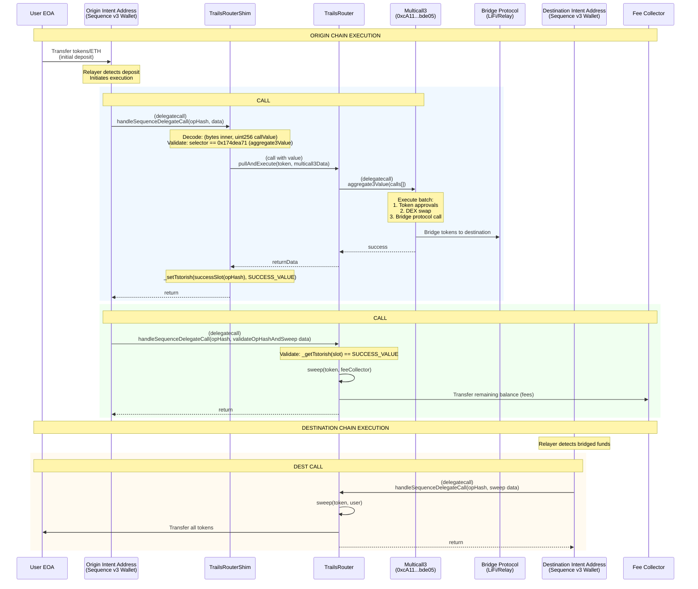
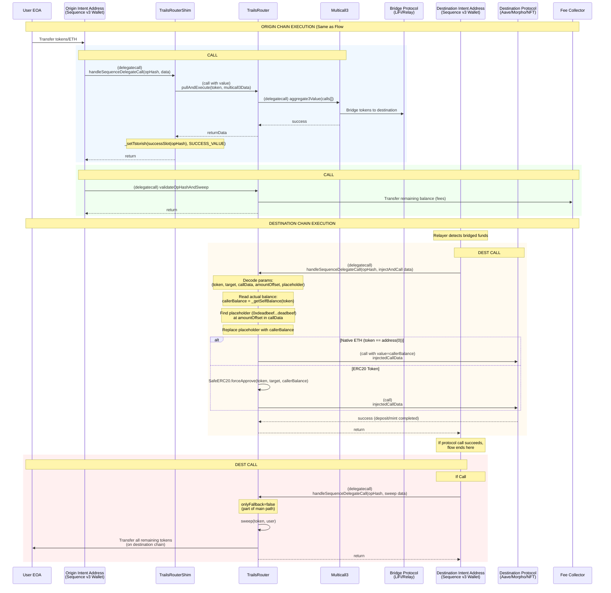
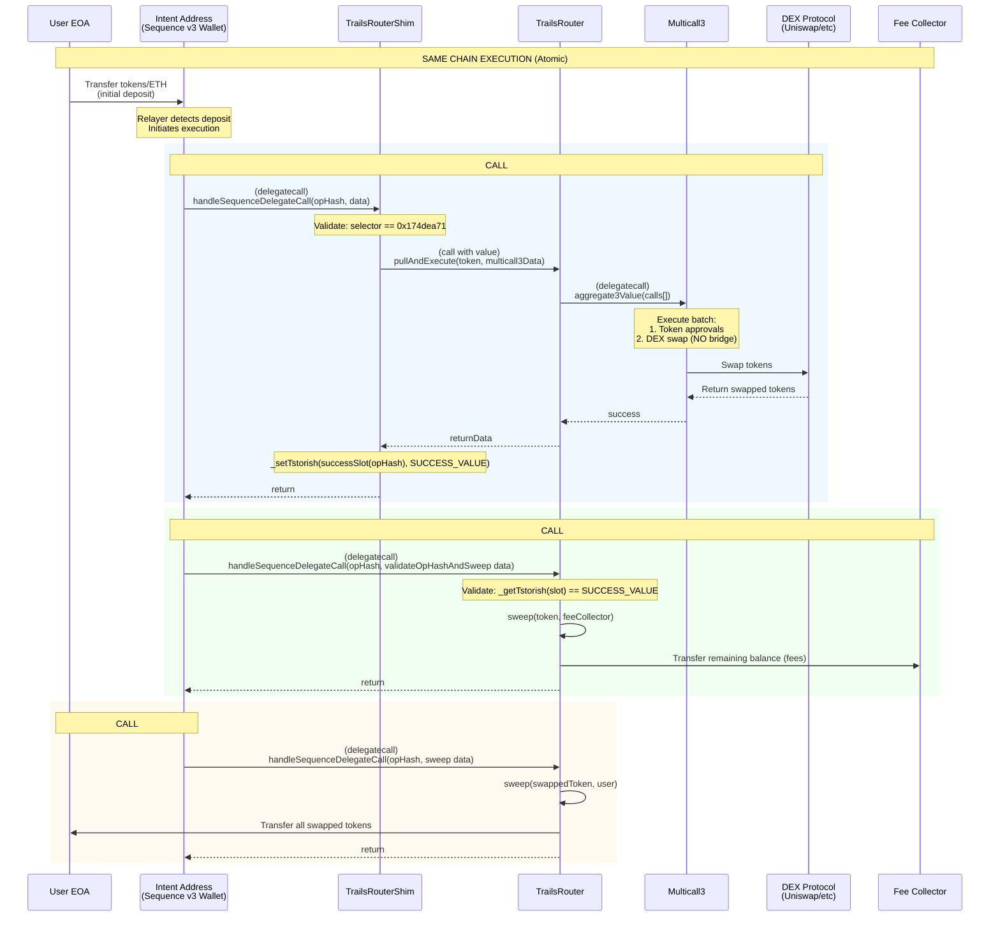
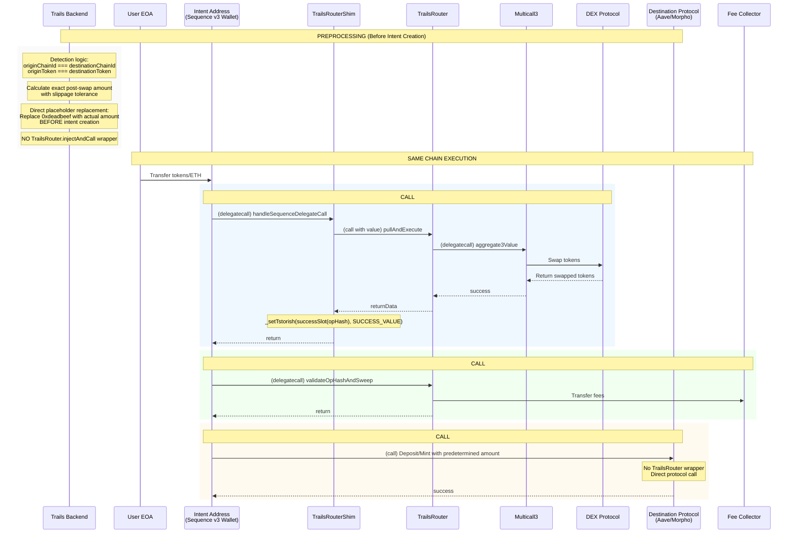
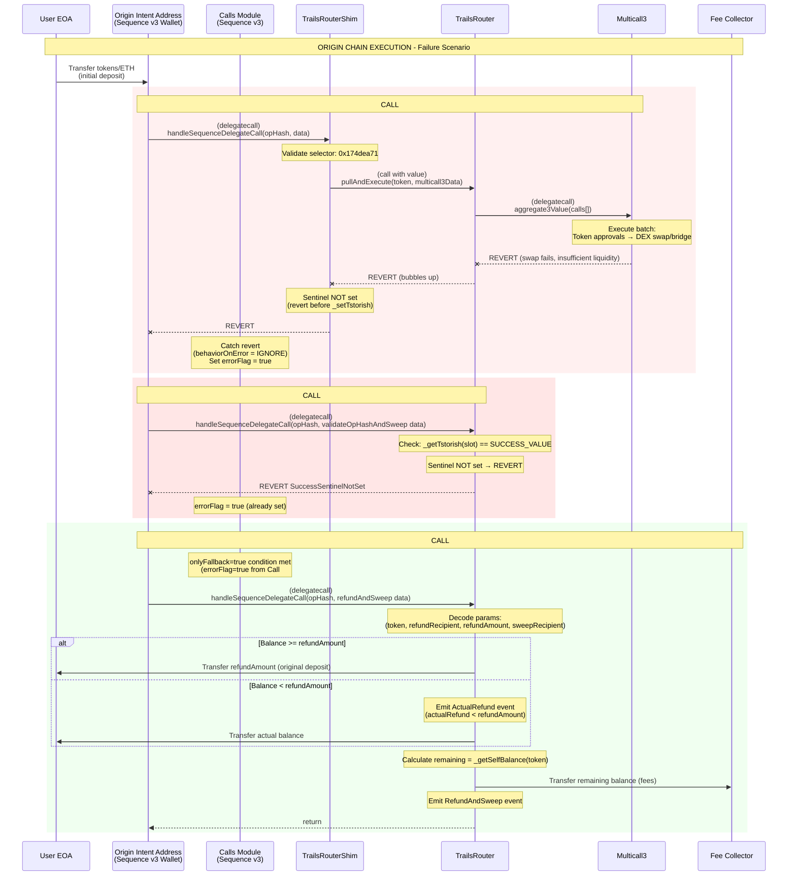
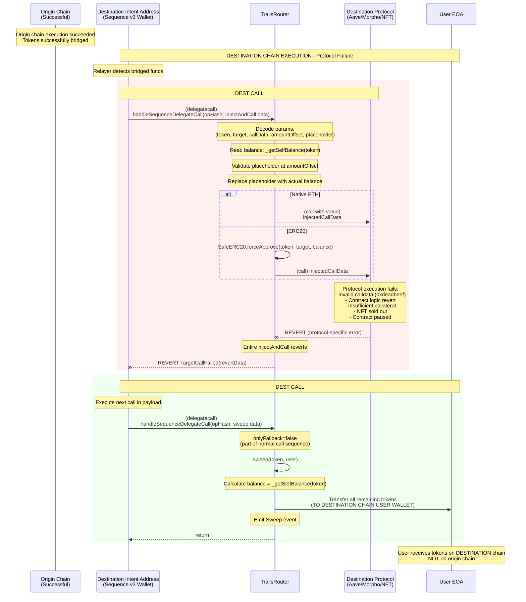

# Trails Contracts - Technical Flow Diagrams

Technical sequence diagrams documenting Trails contract interactions.

---

## 1. Cross-Chain Flow WITHOUT Destination Calldata

**Core Gist:** User bridges/swaps tokens across chains with no custom action on destination

**Key Characteristics:**
- Chains differ between origin and destination
- No protocol interaction on destination (just a simple transfer)
- User receives bridged tokens directly

**Scenario Specifics:** Arbitrum USDC → Base USDC (simple receive/pay/fund scenarios)

### Call Batch Sequence (Origin Chain):
1. **Call #1:** Origin swap and bridge via TrailsRouterShim
2. **Call #2:** Fee collection via `validateOpHashAndSweep()` (success path)
3. **Call #3:** Refund and fee collection via `refundAndSweep()` (fallback path, only if Call #1 fails)

### Call Batch Sequence (Destination Chain):
1. **Call #1:** Sweep tokens to user via `sweep()`



### Implementation Notes:

- **Sentinel lifetime:** Uses `Tstorish` library (tstore on Cancun+, falls back to sstore on older chains)
- **Fee structure:** Fees are taken on the origin chain from whatever's left after bridging
- **Why TrailsRouterShim exists:** Quote providers need a fixed "from" address, but we need the quote to construct the address. TrailsRouterShim needed to overcome this circular dependency.

---

## 2. Cross-Chain Flow WITH Destination Calldata (Balance Injection)

**Core Gist:** User bridges tokens + executes custom protocol interaction on destination with exact bridged amount

**Key Characteristics:**
- Cross-chain flow with destination protocol interaction
- Common use cases: DeFi deposits (Aave, Morpho), NFT minting
- Bridge amount is unknown beforehand (slippage and fees vary)
- Runtime balance injection via `injectAndCall()` fills in the actual amount
- Backend calculates `amountOffset` where placeholder lives in the calldata

**Scenario Specifics:** Arbitrum USDC → Base USDC + Aave deposit | Base ETH → Arbitrum ETH + NFT mint

### Call Batch Sequence (Origin Chain):
1. **Call #1:** Origin swap and bridge via TrailsRouterShim
2. **Call #2:** Fee collection via `validateOpHashAndSweep()` (success path)
3. **Call #3:** Refund and fee collection via `refundAndSweep()` (fallback path, only if Call #1 fails)

### Call Batch Sequence (Destination Chain):
1. **Call #1:** Inject balance and execute protocol interaction via `injectAndCall()`
2. **Call #2:** Sweep tokens to user via `sweep()` (fallback if Call #1 fails)



### Implementation Notes:

- **Why injection?** The bridge amount isn't known until funds actually arrive (slippage and fees affect the final amount)
- **Placeholder format:** We use `0xdeadbeefdeadbeefdeadbeefdeadbeefdeadbeefdeadbeefdeadbeefdeadbeef` as a 32-byte marker
- **amountOffset:** Backend figures out where in the calldata the placeholder sits (byte offset)
- **Native ETH:** No injection needed (amountOffset=0, placeholder=0). We just forward msg.value
- **ERC20 approvals:** `SafeERC20.forceApprove` handles quirky tokens like USDT that need zero approval first
- **Refund location:** If the protocol call fails, user gets tokens on the destination chain, not origin
- **Refunds on destination chain:** Once bridged, the refunds are handled automatically on the destination chain w/ destination token

---

## 3. Same-Chain Flow WITHOUT Destination Calldata

**Core Gist:** User swaps tokens on same chain with no additional protocol interaction

**Key Characteristics:**
- Everything happens on one chain
- Just a DEX swap, no bridging
- No protocol interaction beyond the swap itself
- Atomic—entire flow is one transaction
- Fees get collected before user receives swapped tokens

**Scenario Specifics:** Base USDC → Base ETH | Base ETH → Base USDC

### Call Batch Sequence (Same Chain):
1. **Call #1:** Swap via TrailsRouterShim
2. **Call #2:** Fee collection via `validateOpHashAndSweep()` (success path)
3. **Call #3:** Refund and fee collection via `refundAndSweep()` (fallback path, only if Call #1 fails)
4. **Call #4:** Sweep swapped tokens to user via `sweep()`



### Implementation Notes:

- **Atomic:** Everything's in one transaction, no waiting around
- **Fee timing:** Collect fees before sending swapped tokens to the user
- **Simpler:** No balance injection—amounts doesn't exist

---

## 4. Same-Chain Flow WITH Destination Calldata (Direct Replacement)

**Core Gist:** User swaps tokens AND executes protocol interaction on same chain

**Key Characteristics:**
- Same-chain flow with protocol interaction
- Use cases: DeFi deposits, NFT minting on the same chain
- Amount is deterministic since there's no bridge uncertainty
- NO `injectAndCall()` wrapper—backend replaces placeholder before intent creation
- Optimization: skips TrailsRouter wrapper entirely
- Backend pre-calculates the post-swap amount (accounting for slippage)

**Scenario Specifics:** Base ETH → Base USDC + Aave deposit | Base ETH → Base USDC + Morpho deposit

### Call Batch Sequence (Same Chain):
1. **Call #1:** Swap via TrailsRouterShim
2. **Call #2:** Fee collection via `validateOpHashAndSweep()` (success path)
3. **Call #3:** Refund and fee collection via `refundAndSweep()` (fallback path, only if Call #1 fails)
4. **Call #4:** Execute protocol interaction with predetermined amount (direct call, no TrailsRouter wrapper)



### Implementation Notes:

- **vs. cross-chain:** Amount is knowable ahead of time (no bridge = no uncertainty)
- **Optimization:** We skip the `injectAndCall()` wrapper since the amount is predetermined
- **How we detect this case:** The `wrapCalldataWithTrailsRouterIfNeeded()` function checks if we're on the same chain:
  ```typescript
  if (originChainId === destinationChainId && isSameToken) {
    const calldataWithAmount = calldata.replace(placeholderHex, amountHex)
    return { encodedCalldata: calldataWithAmount, trailsRouterAddress: target }
  }
  ```
- **Direct execution:** Protocol receives calldata with the real amount baked in

---

## 5. Origin Chain Failure & Refund Flow

**Core Gist:** Swap/bridge operation fails on origin chain, user receives full refund

**Key Characteristics:**
- Swap/bridge call fails before any funds leave the origin chain
- Sentinel never gets set (the revert happens before `_setTstorish`)
- Fee collection call also fails since sentinel is missing
- Refund call kicks in via the onlyFallback mechanism
- User gets refunded on origin (funds never made it across)
- We still collect fees even though the operation failed

**Scenario Specifics:** Invalid quote provider, insufficient liquidity, DEX revert, bridge unavailable

### Call Batch Sequence (Origin Chain - Failure):
1. **Call #1:** Origin swap and bridge via TrailsRouterShim **FAILS** (sentinel NOT set)
2. **Call #2:** Fee collection via `validateOpHashAndSweep()` **FAILS** (sentinel not set, skipped)
3. **Call #3:** Refund and fee collection via `refundAndSweep()` **EXECUTES** (onlyFallback=true, errorFlag=true)



### Implementation Notes:

- **errorFlag:** The Calls module sets this when a call reverts with `behaviorOnError = IGNORE`
- **onlyFallback logic:** These calls only run if the previous call reverted
- **Fees on failure:** Fees are collected on the origin chain from any remaining balance during the fallback refund path, even if the transaction fails.
- **Partial refunds:** If there's not enough balance for the full refund, we send what's there and emit `ActualRefund`
- **Atomicity:** Everything happens in one transaction—no way to double-spend

---

## 6. Destination Chain Failure & Refund Flow

**Core Gist:** Bridge succeeds but destination protocol interaction fails, user receives tokens on destination

**Key Characteristics:**
- Origin side works perfectly (swap, bridge, fees all good)
- Funds make it across to destination
- Protocol interaction fails on destination (Aave revert, NFT sold out, etc.)
- Sweep call executes to refund the user
- User gets tokens on destination chain, NOT back on origin
- There's no automatic "undo bridge" mechanism
- If user wants funds back on origin, they bridge manually

**Scenario Specifics:** Invalid calldata, protocol revert (Aave insufficient collateral, NFT sold out), target contract paused

### Call Batch Sequence (Origin Chain):
1. **Call #1:** Origin swap and bridge **SUCCEEDS**
2. **Call #2:** Fee collection **SUCCEEDS**

### Call Batch Sequence (Destination Chain - Failure):
1. **Call #1:** Inject balance and execute protocol via `injectAndCall()` **FAILS**
2. **Call #2:** Sweep tokens to user via `sweep()` **EXECUTES**



---

## Summary: Call Batch Sequences by Flow Type

### Cross-Chain Flows (Success)
**Origin Chain:**
1. **Call #1:** Swap + Bridge via TrailsRouterShim → Sets sentinel on success
2. **Call #2:** `validateOpHashAndSweep()` → Collects fees (success path)
3. **Call #3:** `refundAndSweep()` → Skipped (onlyFallback, but no errorFlag)

**Destination Chain (WITHOUT calldata):**
1. **Call #1:** `sweep(user)` → Transfer all tokens to user

**Destination Chain (WITH calldata - injection):**
1. **Call #1:** `injectAndCall()` → Inject balance + execute protocol
2. **Call #2:** `sweep(user)` → Skipped if Call #1 succeeds

### Same-Chain Flows (Success)
1. **Call #1:** Swap via TrailsRouterShim → Sets sentinel on success
2. **Call #2:** `validateOpHashAndSweep()` → Collects fees (success path)
3. **Call #3:** `refundAndSweep()` → Skipped (onlyFallback, but no errorFlag)
4. **Call #4:** `sweep(user)` OR direct protocol call → Transfer tokens or execute protocol

### Origin Chain Failure
1. **Call #1:** Swap/Bridge via TrailsRouterShim → **FAILS** (sentinel NOT set)
2. **Call #2:** `validateOpHashAndSweep()` → **FAILS** (sentinel missing, errorFlag set)
3. **Call #3:** `refundAndSweep()` → **EXECUTES** (onlyFallback + errorFlag)

### Destination Chain Failure (After Successful Bridge)
**Origin Chain:** All calls succeed (1, 2 complete normally)

**Destination Chain:**
1. **Call #1:** `injectAndCall()` → **FAILS** (protocol revert)
2. **Call #2:** `sweep(user)` → **EXECUTES** (refund on destination chain)

---

## Summary Table: Flow Decision Matrix

| Scenario | Origin Chain | Destination Chain | Injection Used? | Key Function |
|----------|--------------|-------------------|-----------------|--------------|
| Cross-chain simple transfer | Same as any flow | `sweep(user)` | No | N/A |
| Cross-chain with dest calldata | Same as any flow | `injectAndCall()` | **Yes** | Balance unknown until post-bridge |
| Same-chain simple swap | `pullAndExecute()` | N/A (same chain) | No | N/A |
| Same-chain with dest calldata | `pullAndExecute()` | N/A (same chain) | **No** | Backend replaces placeholder pre-intent |
| Origin failure | `refundAndSweep()` (fallback) | N/A (never bridged) | No | Refund + fee collection |
| Destination failure | Same as any flow | `sweep(user)` (after revert) | Attempted but failed | Refund on destination chain |
